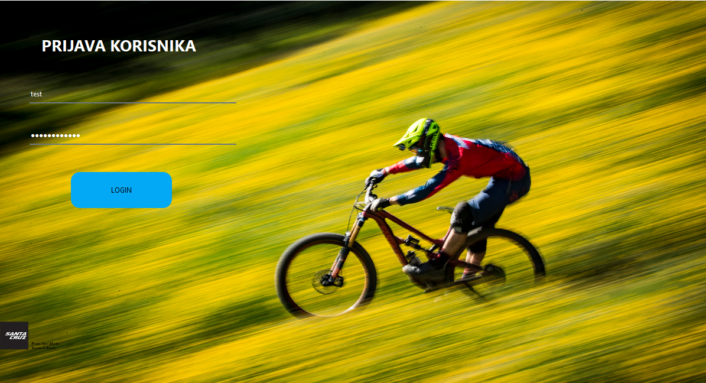
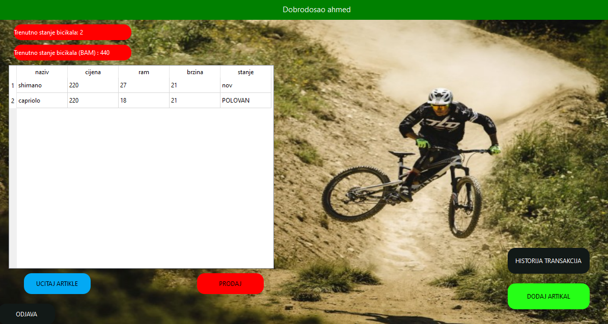
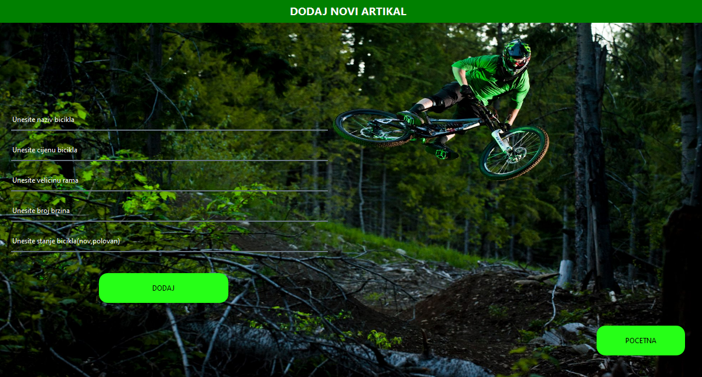
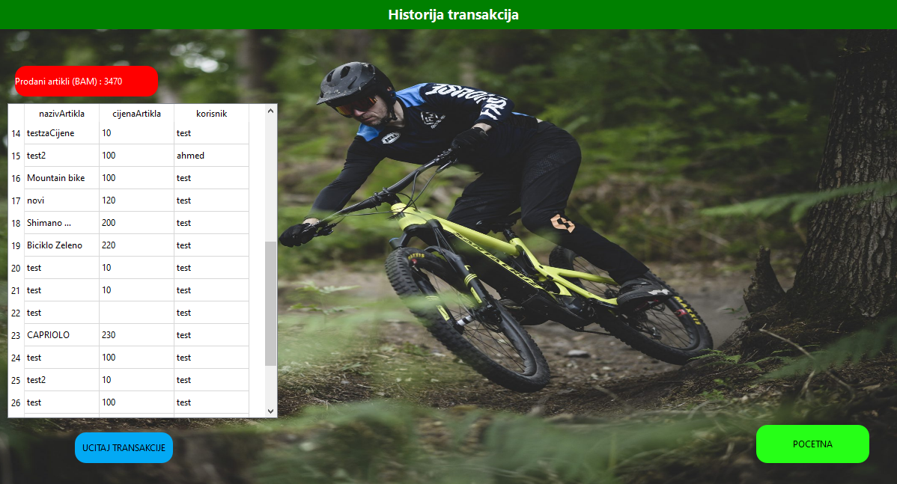

# Bike Shop

The main goal of the application is to make the work of the owner of a bicycle shop easier.Bike shop is created using Qt Creator (Widget App), C++, SQL.

# Features

- Only registered users have access to the application (login and register form, user authentication)
- Tab that shows all bikes
- Tab for creating bikes(including bicycle attributes such as price, frame size, condition ( new, used), number of gears)  
- Tab for Dashboard - the home page includes the dashboard, simple user insight into the current state (number of available bikes) and revenue estimation in [BAM] based on active items
- Tab for the transaction history provides a simple overview of completed transactions, offering a statistical display of the most sold bikes (and other useful statistical parameters).
## Home page

## Register

## Login

## Dashboard

## Add new bike

## Transaction history

