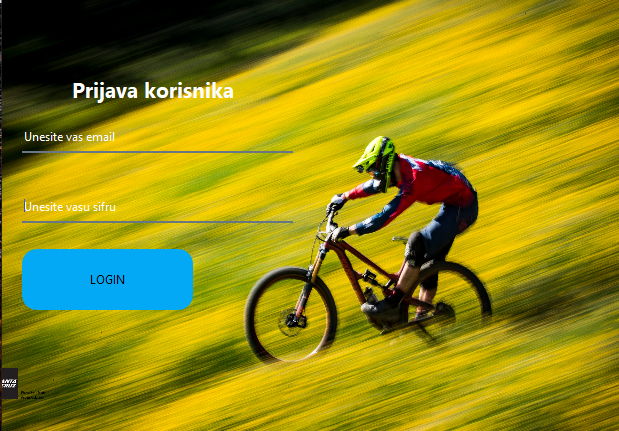
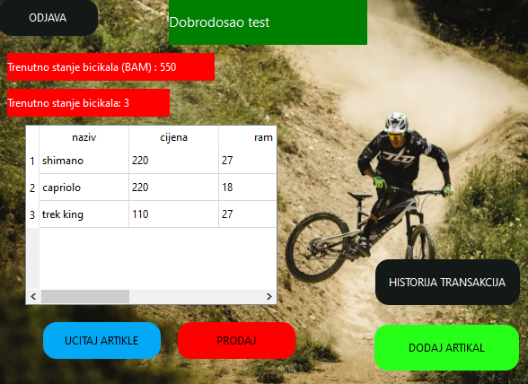
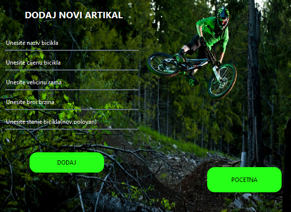
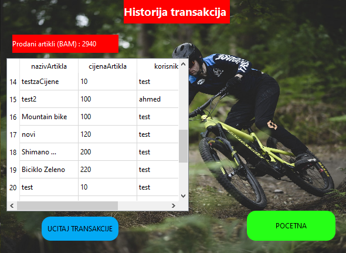

# Bike Shop

Cilj aplikacije je da vlasniku prodavnice za prodaju bicikala olaksa rad.

# Funkcionalnosti

- Aplikaciji imaju pristup samo registrovani korisnici (login i registracijska forma, autentikacija korisnika)
- Tab sa prikazom artikala
- Tab za kreiranje artikala (ukljucujuci atribute bicikla kao sto su cijena, velicina rama, stanje (nov, polovan), broj brzina itd)
- Tab za dashboard - pocetna stranica ukljucuje dashboard, tj. jednostavan uvid korisnika u trenutno stanje (broj dostupnih bicikala) i estimaciju prihoda u [BAM] na osnovu aktivnih artikala
- Tab historija transakcija omogucava jednostavan uvid u zavrsene transakcije nudeci statisticki prikaz bicikala koji se najvise prodaju (i druge korisne statisticke parametre)
## Pocetna stranica

## Registracija

## Login

## Dashboard

## Dodaj artikal

## Historija transakcija

